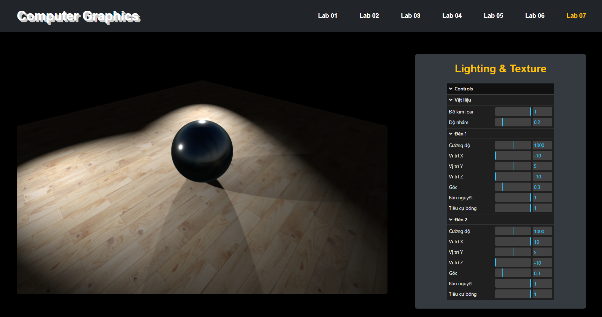

# CS105 - Computer Graphics (UIT)
Đây là các Bài Thực Hành Đồ Họa Máy Tính. Kho lưu trữ này chứa các bản demo tương tác về các khái niệm đồ họa máy tính khác nhau, gồm các thuật toán rasterization, phép biến đổi affine 2D và 3D, đường cong, fractal, phép biến đổi quan sát, và ánh sáng,..

## 1. Nội dung
### Lab 01: Rasterization

Minh họa các thuật toán vẽ đường thẳng DDA, Bresenham, đường tròn Midpoint và vẽ hình elip.


### Lab 02: Biến đổi Affine (2D)

Minh họa các phép biến đổi affine 2D như tịnh tiến, quay, tỷ lệ,...

### Lab 03: Đường cong

Khám phá các kỹ thuật tạo đường cong khác nhau như hàm số, Bezier, Hermite

### Lab 04: Fractal

Tạo ra nhiều mẫu fractal khác nhau như Koch Snowflake, Minkowski Island, Sierpinski Triangles , Sierpinski Carpet, Mandelbrot.

### Lab 05: Biến đổi Affine (3D)

Minh họa các phép biến đổi affine 3D (tịnh tiến, quay, tỷ lệ) trên nhiều đối tượng 3D khác nhau (hộp, hình cầu, hình nón, hình trụ, hình xuyến).

### Lab 06: Biến đổi Quan sát

Khám phá điều khiển camera trong cảnh 3D. Cho phép điều chỉnh các tham số LookAt và VRP (View Reference Point) để thay đổi góc nhìn của camera.

### Lab 07: Ánh sáng & Vật liệu

Trình bày các mô hình ánh sáng và ánh xạ vật liệu trên các đối tượng 3D.


## 2. Cây thư mục
```bash
├── index.html
└── src/
    ├── main.js
    ├── lab01.js
    ├── ...
    ├── lab07.js
    ├── lab01-$.js          #$: dda, bresenham, midpoint, ellipse
    ├── lab02-shaders.js
    ├── lab03-$.js          #$: graph, graph, bezier, hermite
    ├── lab04-$.js          #$: vankoch, minkowski, sierpinskiT, sierpinskiC, mandelbrot, julia
    ├── webgl-lessons-ui.js
    └── webgl-utils.js
└── style/
    └── style.css
    └── lab01.css
    └── ...
    └── lab07.css
└── img/
    └── ...
```
## 3. Cách chạy
Clone hoặc tải xuống kho lưu trữ này về máy tính của bạn.
 ```bash
git clone https://github.com/HuynhNghiaKHMT/Computer-Graphics
```

Điều hướng đến thư mục gốc của dự án. Mở index.html trong trình duyệt web yêu thích của bạn (ví dụ: Chrome, Firefox, Edge).

## 4. Các thư viện sử dụng
* Các tệp JavaScript làm việc webgl (lab 01 -> lab 04):
    - webgl-utils.js
    - webgl-lessons-ui.js
* Three.js: Một thư viện JavaScript 3D được sử dụng để hiển thị đồ họa 3D (đặc biệt cho Lab 05, Lab 06 và Lab 07). Được tải qua CDN, Phiên bản: 0.160.0.

    ```bash
    <script type="importmap">
        {
        "imports": {
            "three": "https://cdn.jsdelivr.net/npm/three@0.160.0/build/three.module.js",
            "three/addons/": "https://cdn.jsdelivr.net/npm/three@0.160.0/examples/jsm/"
            }
        }
    </script>
    ```


## 5. Hình ảnh minh họa
### Lab 01: Rasterization

### Lab 02: Biến đổi Affine (2D)

### Lab 03: Đường cong

### Lab 04: Fractal

### Lab 05: Biến đổi Affine (3D)

### Lab 06: Biến đổi Quan sát

### Lab 07: Ánh sáng & Vật liệu
